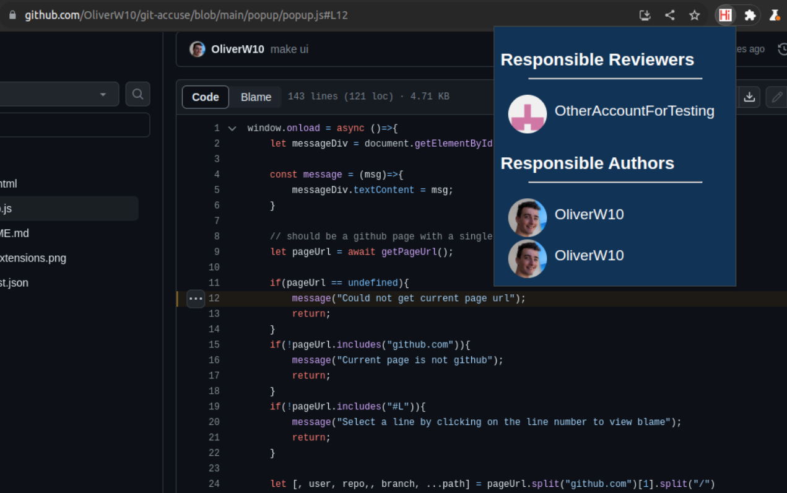

# Git Accuse

Sometimes you need to find ALL responsible people and `git blame` is just not enough

This is a chrome extension that allows you to find not only the author of the code but also all the people who reviewed the code and previous authors of the code

